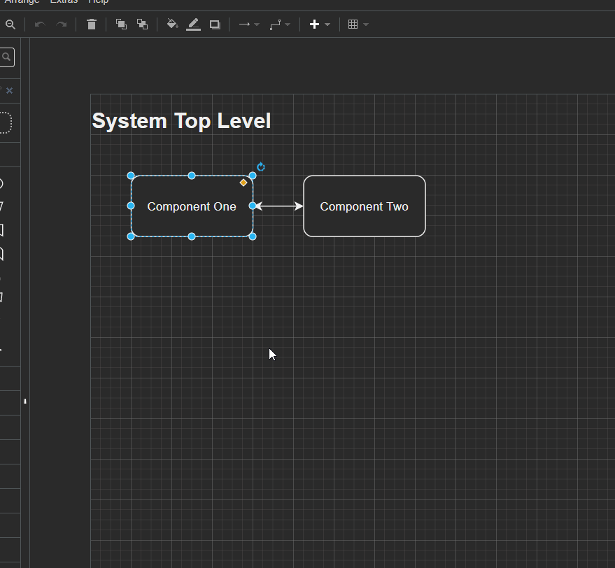

# Drawio / Diagrams.net Plugin - Local Links
## Disclaimer / Support
Use this plugin at your own risk - I'm not responsible for any issues, data loss, etc.
Only supported in `Drawio-desktop` while opening local files.
  * It has been tested on Ubuntu and Windows (Drawio v14.5.1)
Very open to pull requests!

## Problem To Solve
Drawio allows links to other pages in the same diagram, or web links.
However, it does not allow linking to other local diagram files - this plugin 
bridges that gap using relative paths from the currently open diagram.
* For example: `top_level.drawio.png` with a block linking to a relative path'd
  `component_two/docs/comp_two.drawio.png`

## Demo

## Use Cases
This is useful for larger projects consisting of submodules or many folder each
containing its own "component". 

Links taking users through separate diagrams also allows each component 
to be agnostic to the rest of the system - modular diagrams that can be tied 
together at a system level, without having one monolithic "system" diagram.

## Installation / Test Example
* Install the plugin : Drawio-desktop -> `Extras` -> `Plugins...` -> `Add...`
  -> `Select File...` -> `<this repo's cloned path>/src/locallinks.js`
* Open `test/top_level.drawio.png`, right click on the `Component One` block -> 
  `Plugin: Local Links` -> to Edit or Open the local links. See the above demo.

## Possible Improvements
* Add ability to preview the linked image instead of opening a new Drawio instance
* Add ability to preview other files - like `readme.md` using paths

## Additional Suggestion - Drawio VSCode Extension
* Use `Draw.io Integration by Henning Dieterichs` for great Drawio -> VSCode integration
    * [VSCode Extension Link](https://marketplace.visualstudio.com/items?itemName=hediet.vscode-drawio)
    * [Github link here](https://github.com/hediet/vscode-drawio)
    * **Note:** Don't believe this supports Plugins (like this repo, though)
